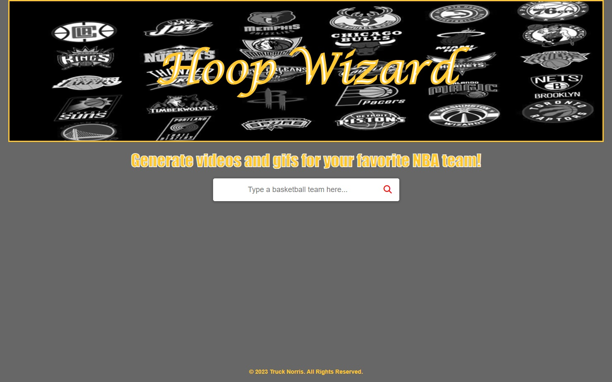

# Hoop Wizard

## Description

We were tasked with creating an app that calls for API data from two different sources. We chose to pull gifs and YouTube videos for each of the 30 NBA teams. We used a combination of jQuery functions, for loops, font awesome icons, and two API functions that pull data from Giphy and YouTube.

## Installation

No installation necessary but you can clone the [repository](https://github.com/truck-norris/hoop-wizard) from GitHub to edit it and make your own version.

## Usage

When the user loads the page, they can choose a team from the search box and the team name will auto populate in a drop down box based on what words were used to search with. Once a team is selected, a set of gifs and a recent YouTube video will populate the screen.

## Credits

Collaborators are [Adrian Ciocan](https://github.com/Adrian-G-C), [David Kolodziej](https://github.com/davidkolodziej), [Jessie Galindo](https://github.com/MrMessyFace), and [Kar Sodhi](https://github.com/karsodhi), with [Theo Ward](https://github.com/Tward9) as our TA advisor. The autocompleting search bar function was taken from [Coding Nepal](https://www.codingnepalweb.com/search-bar-autocomplete-search-suggestions-javascript/). The giphy generator was created based on two class activities from the Northwestern University Full Stack Coding Bootcamp.

## Helpful Links

- [Repository](https://github.com/truck-norris/hoop-wizard)
- [Live App](https://truck-norris.github.io/hoop-wizard/)

&copy; 2023 Truck Norris. All Rights Reserved.
